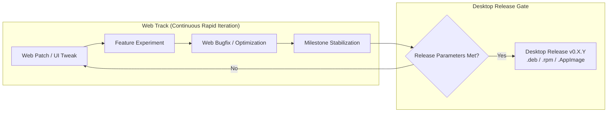

# 🤖 Vanaila Chat — Agent & Engineering Guidelines

> [!CAUTION]
> ### 🛑 STRICT AGENT EXECUTION RULES
> 1. **DO NOT PUSH OR DEPLOY BEFORE EXPLICIT USER INSTRUCTION**:
>    - Never execute `git push` or deploy commands unless explicitly instructed by the user in their prompt.
> 2. **DO NOT COMMIT UNFINISHED OR UNVERIFIED WORK**:
>    - Never run `git commit` while changes or ongoing processes are still broken or unverified. Iterate and fix everything first, and only commit when work is complete and tested.

This document defines architecture standards, development workflows, and release cadence policies for agents and developers working on **Vanaila Chat**.

---

## 🏛️ 1. Architecture & Dual-Target Strategy

Vanaila Chat operates on a unified codebase serving two targets:

1. **🌐 Web Edition**:
   - Frontend: React 19 + Vite 6 + TypeScript (ESM)
   - Backend: Node.js 22 + Hono 4.6 + `better-sqlite3` (WAL mode)
   - Launcher: `start.sh` (Linux/macOS), `start.bat` / `start.ps1` (Windows)
2. **🦀 Native Linux Desktop Edition (`com.vanaila.chat`)**:
   - Runtime: Tauri 2.0 + Rust
   - Database: Native Rust SQLite (`rusqlite` bundled) with identical schema migrations
   - Distro Bundles: Debian/Ubuntu (`.deb`), Fedora/RHEL (`.rpm`), Universal (`.AppImage`), Arch (`PKGBUILD`), Flatpak

---

## 🚀 2. Release Cadence Policy: Desktop vs. Web Version

### Question: *Will desktop updates mirror the web version directly, or release after several iterations?*

### 📌 Strategy: **Batched Milestone Releases (Stabilized Cadence)**

The desktop app **will NOT mirror every single commit or minor web tweak immediately**. Instead, it follows a **Batched Milestone Strategy** (typically every **3–5 minor web iterations or key feature milestones**).



### 🎯 Parameters & Triggers for a Desktop Release:

A new desktop update (`v0.X.Y`) should be triggered when **ANY** of the following conditions are met:

1. **✨ Significant Milestone / Feature Aggregation**:
   - A batch of 3–5 web feature iterations is complete and verified.
   - New major capability added (e.g., in-app model pull progress, native local embedding engine, global shortcuts, multi-tab windowing).
2. **🛡️ Critical Hotfix Exception (Immediate Mirroring)**:
   - **Security fix**: Keyring vulnerabilities, SSRF bypass, sandbox breakout in tool execution.
   - **Protocol breakage**: Major upstream API breakage (e.g., Ollama or OpenAI payload schema change).
   - **Database corruption**: SQLite migration bug affecting message storage.
3. **🧪 Quality & Verification Gates Passed**:
   - 100% of Vitest unit/integration tests pass (`pnpm test` -> 240+ tests).
   - 100% of Rust tests pass (`cargo test --manifest-path src-tauri/Cargo.toml`).
   - Lint & type safety check: `eslint . --max-warnings=0` and `tsc --noEmit`.
   - Tauri Linux packaging check: `pnpm desktop:build` completes without bundle warnings.

---

## 📱 3. Responsive UI & Cross-Device Ergonomics Standards

All frontend components must support **4 viewport classes**:

| Viewport Class | Target Screen Width | Layout Rules & Ergonomics |
| :--- | :--- | :--- |
| **📱 Mobile** | `< 640px` (iPhone, Android, Foldables) | - Header is a single 48px row with compact icon toggles.<br/>- `.role-picker` is a single horizontal scrolling row (`overflow-x: auto`).<br/>- Composer textarea has `min-height: 48px` (no tall 120px boxes).<br/>- Send button is inline on the toolbar row (not a full-width bottom bar).<br/>- Sidebar closes automatically on chat select / new chat.<br/>- Tables and code blocks have horizontal touch scrolling. |
| **📟 Tablet / Foldable** | `640px – 1024px` (iPad, Surface Duo, Tablets) | - Sidebar defaults to overlay/drawer mode.<br/>- Header displays compact app badge and active status.<br/>- Composer balances model selector, actions, and Send inline. |
| **💻 Standard Desktop** | `1024px – 1600px` (Laptops, 1080p monitors) | - Persistent collapsible sidebar (`Ctrl+B`).<br/>- Chat column centered with reading max-width of `1180px`.<br/>- Full status indicators in header. |
| **🖥️ Wide & 4K Displays** | `> 1600px` (Ultrawide, 2K/4K monitors) | - Chat log remains centered and proportioned without floating layout breaks.<br/>- Side-by-side Codebase Activity Panel opens without squishing the main chat column. |

---

## 🛠️ 4. Standard Desktop Release Command Checklist

When initiating a new desktop release:

```bash
# 1. Verify all tests and builds
pnpm lint
pnpm type-check
pnpm test
cargo test --manifest-path src-tauri/Cargo.toml
pnpm desktop:build

# 2. Update version strings synchronously
# - package.json
# - src-tauri/Cargo.toml
# - src-tauri/tauri.conf.json
# - packaging/PKGBUILD

# 3. Commit, tag, and push to trigger automated CI/CD release
git add .
git commit -m "chore: release v0.X.Y"
git tag v0.X.Y
git push origin main --tags
```
