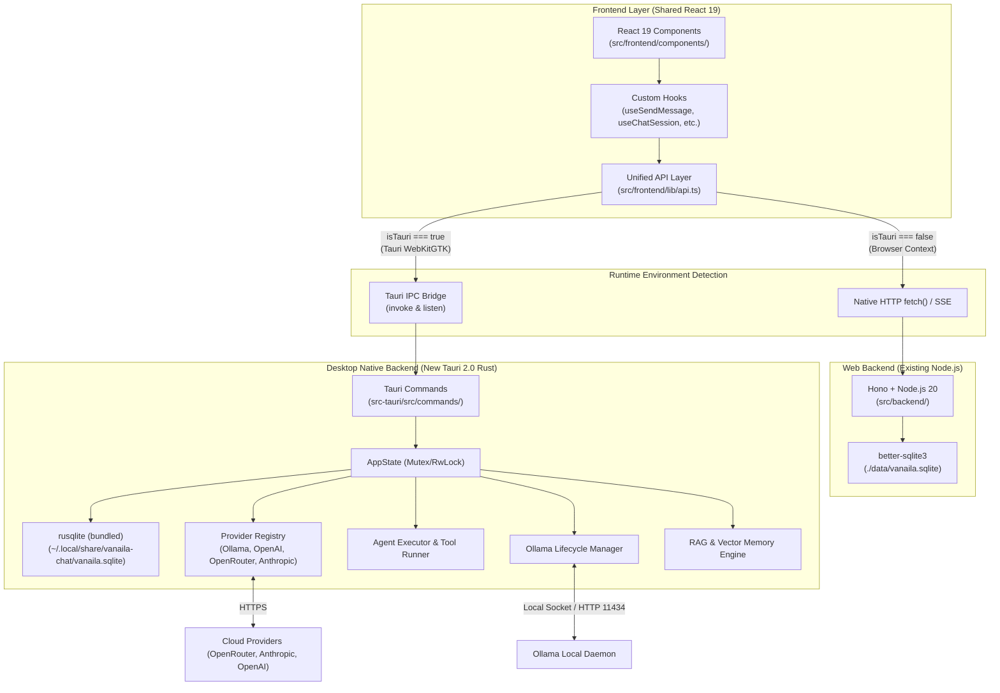

# Vanaila Chat — Linux Desktop Architecture (Tauri 2.0)

This document establishes the architecture for the **native Linux desktop edition** of Vanaila Chat (`com.vanaila.chat`).

The desktop application is built as an independent, high-performance Linux client that coexists with the existing web version. Both editions share the React 19 frontend codebase, while the desktop edition runs a lightweight, native Rust backend powered by **Tauri 2.0**.

---

## 1. Architectural Principles

1. **Zero Impact on Web App**: The existing Node.js/Hono server (`src/backend/`), `start.sh`, and web development workflow (`pnpm dev`) remain 100% operational and untouched.
2. **Shared Frontend Component Tree**: The React 19 frontend (`src/frontend/`) is shared. A thin API layer (`src/frontend/lib/api.ts`) transparently dispatches requests to standard HTTP `fetch` in web mode or Tauri `invoke`/`listen` IPC in desktop mode.
3. **Maximum Linux Performance**:
   - Zero Node.js runtime overhead in the desktop binary.
   - Native WebKitGTK 4.1 engine without bundling Chromium.
   - Rust-native SQLite (`rusqlite` bundled) for sub-millisecond database queries.
   - SIMD-accelerated cosine similarity search for local RAG / memory vectors.
4. **Desktop-Grade UX & System Integration**:
   - System tray (`libayatana-appindicator`) with background keepalive for Ollama.
   - Strict XDG Base Directory specification compliance.
   - Dedicated Linux desktop entry, MIME associations, and high-resolution scalable icon branding.
   - Native splash screen and desktop-optimized UI layouts.

---

## 2. High-Level Architecture Diagram



---

## 3. Runtime Detection & API Abstraction

### 3.0 Release parity boundary (v0.3.1)

The web and native editions share the React frontend, persistence-facing API layer, and visual improvements. For v0.3.1, the native command set covers chats, messages, projects, settings, models/model pulls, backup/restore, training-example review/export, coding sessions, coding-provider streaming, Git status/diff/branch controls, skills, research, and chat tool approvals. The web edition continues to provide the Node/Hono route implementations and the in-app filesystem browser. Native commands are not automatically extended when a web route changes, so each parity change is verified independently.

The v0.3.1 desktop release is build-ready for Debian and RPM artifacts. AppImage generation remains an environment-dependent packaging job and must pass on the Ubuntu 22.04 release runner before publishing a universal artifact.

The frontend dynamically detects its runtime environment via `__TAURI_INTERNALS__`:

```typescript
// src/frontend/lib/api.ts
export const isTauri = typeof window !== 'undefined' && '__TAURI_INTERNALS__' in window;
```

### 3.1 Request-Response Command Mapping (CRUD)
Standard asynchronous data fetching is mapped cleanly between HTTP REST and Rust Commands:

| Endpoint (Web) | Method | Tauri Command (Desktop) | Description |
| :--- | :--- | :--- | :--- |
| `/api/chats` | `GET` | `get_chats` | Retrieve all chat sessions |
| `/api/chats` | `POST` | `create_chat` | Create / upsert a chat |
| `/api/chats/:id` | `PATCH` | Frontend persistence fallback | Update title, pinned, system prompt |
| `/api/chats/:id` | `DELETE` | `delete_chat` | Delete chat and cascade messages |
| `/api/messages` | `GET` | `get_messages` | Retrieve messages for chat |
| `/api/messages` | `POST` | `save_message` | Save message record |
| `/api/messages/search` | `GET` | `search_messages` | FTS5 full-text message search |
| `/api/models` | `GET` | `get_models` | Aggregated model catalog |
| `/api/settings` | `GET` | `get_settings` | Load key-value settings |
| `/api/settings/:key` | `PUT` | `update_setting` | Save setting & invalidate model cache |
| `/api/projects` | `GET` / `POST` | `get_projects` / `create_project` | Workspace project management |
| `/api/skills` | `GET` / `POST` | `get_skills` / `install_skill` | Skills catalog & installations |
| `/api/training/*` | `GET` / `POST` | `get_training_examples` / `get_training_stats` / `export_training_data` | Training review and export |
| `/api/coding/sessions` | `GET` / `POST` | `get_coding_session` / `create_coding_session` / `update_coding_session` | Coding workspace sessions |
| `/api/git/*` | `POST` | `get_git_status` / `get_git_diff` / `create_git_branch` | Workspace Git controls |

### 3.2 Real-Time Event Streaming
For chat completions and deep research, Tauri's native event streaming provides lower latency than HTTP chunked transfers:

```typescript
// Streaming Abstraction
export async function streamChat(
  params: ChatParams,
  onChunk: (chunk: StreamChunk) => void,
  signal?: AbortSignal
): Promise<void> {
  if (isTauri) {
    const { invoke } = await import('@tauri-apps/api/core');
    const { listen } = await import('@tauri-apps/api/event');
    
    const unlisten = await listen<StreamChunk>('chat-stream', (event) => {
      onChunk(event.payload);
    });

    const abortHandler = () => {
      invoke('cancel_chat');
      unlisten();
    };
    signal?.addEventListener('abort', abortHandler, { once: true });

    try {
      await invoke('start_chat', { params });
    } finally {
      unlisten();
      signal?.removeEventListener('abort', abortHandler);
    }
    return;
  }

  // Fallback to Web NDJSON streaming loop
  const response = await fetch('/api/chat', {
    method: 'POST',
    headers: { 'Content-Type': 'application/json' },
    body: JSON.stringify(params),
    signal,
  });
  // ... existing ReadableStream NDJSON line reader ...
}
```

---

## 4. Rust Engine Structure (`src-tauri/`)

```
src-tauri/
├── Cargo.toml               # Native dependencies & release profile
├── tauri.conf.json          # App identifier, windows, bundle configuration
├── capabilities/
│   └── default.json         # Security capability manifest
├── icons/                   # High-res icons (16px to 512px + SVG)
└── src/
    ├── main.rs              # Application entry point
    ├── lib.rs               # Builder, plugin registrations, setup hook
    ├── error.rs             # Unified Rust error enum with Serde serialization
    ├── state.rs             # Shared AppState container
    ├── commands/            # Tauri command IPC handlers (14 modules)
    ├── db/                  # rusqlite wrapper & schema migration runner (15 migrations)
    ├── providers/           # LLM Providers (Ollama, OpenAI, Anthropic, OpenRouter)
    ├── agent/               # Multi-turn tool execution loop & approval engine
    ├── services/            # Background managers (Ollama, Memory, Skills, Research)
    ├── tools/               # Local filesystem, search, and shell execution tools
    └── desktop/             # Linux XDG, System Tray, and Freedesktop integration
```

---

## 5. State Management & Thread Safety

The desktop backend leverages `tokio` and `parking_lot` for asynchronous performance without thread starvation:

```rust
pub struct AppState {
    pub db: Arc<parking_lot::Mutex<Database>>,
    pub provider_registry: Arc<ProviderRegistry>,
    pub ollama_manager: Arc<OllamaManager>,
    pub settings: Arc<SettingsService>,
    pub approval_service: Arc<ApprovalService>,
    pub active_stream_abort: Arc<tokio::sync::Mutex<Option<tokio::sync::oneshot::Sender<()>>>>,
}
```

- **Database Concurrency**: The SQLite connection uses WAL (Write-Ahead Logging) mode, enabling high-speed read concurrency alongside safe, serial writes.
- **Provider Streaming**: Outbound API requests use `reqwest` with HTTP/2 and connection pooling to ensure zero stream stuttering.
- **Cancellation**: Any running token stream or agent loop can be instantly aborted via an asynchronous `oneshot` cancellation token.

---

## 6. Migration & Database Coexistence

- **Web Location**: `./data/vanaila.sqlite` (relative to repository).
- **Desktop Location**: `~/.local/share/vanaila-chat/vanaila.sqlite` (XDG compliant).
- **First-Launch Migration Helper**: If `~/.local/share/vanaila-chat/vanaila.sqlite` does not exist on startup, the Rust setup routine checks for `./data/vanaila.sqlite` or prompts the user to import their existing chat history seamlessly.
- **Database Engine Parity**: Both backends enforce the exact same 15 schema migrations, ensuring 100% interoperability.
