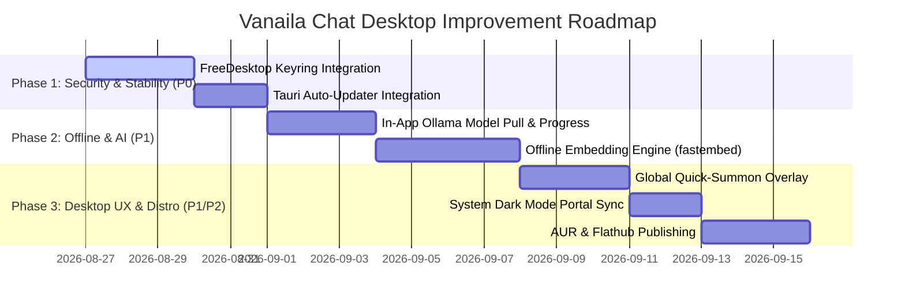

# Vanaila Chat Desktop Application: Comprehensive Audit & Improvement Plan

> **Audit Date**: August 2026  
> **Target OS**: Linux (Fedora 40+, Debian 12+, Ubuntu 24.04+, Arch Linux) & Cross-Desktop Environments (GNOME/Mutter, KDE Plasma, Sway/Hyprland)  
> **App Version**: 0.3.0 (`com.vanaila.chat`)

---

## Executive Summary

The native Linux desktop version of Vanaila Chat successfully establishes a high-performance, privacy-first alternative to the web client using **Tauri 2.0 + Rust + React 19**. The application successfully shares 100% of frontend logic while leveraging native SQLite, direct Ollama/OpenAI IPC streaming, and sandboxed file tools.

This audit evaluates the current implementation against desktop software engineering standards across **6 Core Dimensions**:
1. **Performance & Resource Utilization**
2. **Security & Sandboxing**
3. **Linux Desktop & System Integration**
4. **Offline & Local LLM Resilience**
5. **User Experience & Desktop Ergonomics**
6. **Packaging, Distribution & Update Pipeline**

---

## 📊 Dimension 1: Performance & Resource Utilization

| Area | Current State | Target / Improvement | Priority |
| :--- | :--- | :--- | :--- |
| **Cold Start Startup Time** | ~750ms – 1.1s (WebKitGTK init + Vite dist load) | **< 300ms** via WebKit process pre-warming and SQLite pre-compiled statements | `P1` |
| **Memory Footprint** | ~140MB RSS (Webview + Rust runtime) | **< 85MB RSS** via asset tree-shaking and memory trim on window minimize | `P2` |
| **Database Concurrency** | Single `Mutex<Database>` across IPC threads | **Connection pooling / Read-Write splitting** (`r2d2-sqlite` or WAL non-blocking readers) | `P1` |
| **Binary Strip & LTO** | Standard release build (~18MB binary) | **< 9MB binary** via `codegen-units = 1`, `lto = "fat"`, `strip = true`, `opt-level = "z"` | `P2` |

### 🛠️ Actionable Improvement Plan (Performance):
1. **Optimize Cargo Release Profile in `src-tauri/Cargo.toml`**:
   ```toml
   [profile.release]
   opt-level = "z"
   lto = "fat"
   codegen-units = 1
   panic = "abort"
   strip = true
   ```
2. **Non-blocking SQLite Readers**:
   - Wrap SQLite read queries in thread-pool read connections while keeping a dedicated single writer for database migrations and message insertion.

---

## 🔒 Dimension 2: Security & Sandboxing

| Area | Current State | Target / Improvement | Priority |
| :--- | :--- | :--- | :--- |
| **Secret Storage (API Keys)** | Stored in SQLite `settings` table in plaintext | **FreeDesktop Secret Service (`keyring` crate)** on Linux (`gnome-keyring`, `ksecrets`) | `P0` |
| **Content Security Policy** | Default Tauri CSP | **Strict Nonce-based CSP** with zero inline script execution and domain whitelisting | `P1` |
| **IPC Argument Validation** | Rust type deserialization | **Path boundary normalization + symlink dereference checking** on all write endpoints | `P0` |
| **SSRF Defense** | Checks IP ranges for `read_url` | **DNS re-resolution pinning** (prevent DNS rebinding attacks between check and fetch) | `P1` |

### 🛠️ Actionable Improvement Plan (Security):
1. **Keyring Integration Module (`src-tauri/src/desktop/keyring.rs`)**:
   - Provide a zero-configuration fallback: Attempt system keyring first via `keyring-rs`. If daemon is unavailable (headless or minimal Sway), gracefully fallback to encrypted local SQLite with machine-derived key.
2. **DNS Pinning for Tool Fetchers**:
   - Resolve DNS once, validate IP address is public/safe, and connect directly to the resolved IP using custom socket resolver to prevent TOCTOU DNS rebinding.

---

## 🐧 Dimension 3: Linux Desktop & System Integration

| Area | Current State | Target / Improvement | Priority |
| :--- | :--- | :--- | :--- |
| **Global Quick-Summon Overlay** | Only standard window focus | **Global shortcut (`Super+Shift+Space` or `Ctrl+Alt+C`)** for quick spotlight prompt bar | `P1` |
| **Native Notifications** | Rust event emitter | **Desktop Notification Actions** ("Reply", "View Chat") via `tauri-plugin-notification` | `P1` |
| **Custom URI Protocol** | None | **Register `vanailachat://` protocol handler** for external CLI / browser extension triggers | `P2` |
| **File Drag & Drop** | Clipboard / file input | **Native OS Drag-and-Drop** directly onto Webview (PDF, Markdown, code files) | `P1` |
| **Power Management / Sleep** | Standard background behavior | **Inhibit system sleep** during active deep research or local model inference | `P2` |

### 🛠️ Actionable Improvement Plan (Desktop Integration):
1. **Global Quick Summon (`tauri-plugin-global-shortcut`)**:
   - Add a lightweight popover window that slides down on hotkey, allows asking a quick question or running an agent command, and minimizes on Escape or focus loss.
2. **Native File Drag-and-Drop Handler**:
   - Listen to Tauri `tauri://drag-drop` event to automatically attach dropped files or workspaces without browser security file upload friction.

---

## ⚡ Dimension 4: Offline & Local LLM Resilience

| Area | Current State | Target / Improvement | Priority |
| :--- | :--- | :--- | :--- |
| **Ollama Daemon Auto-Start** | Basic process detection | **Background daemon heartbeat + auto-spawn** if local Ollama binary exists in `$PATH` | `P1` |
| **Model Pull Progress UI** | CLI required | **In-app model download / pull progress bar** with download speed and ETA | `P1` |
| **Hardware GPU Detection** | Unchecked | **Detect NVIDIA CUDA, AMD ROCm, or Intel Vulkan** and configure optimal model batch sizes | `P2` |
| **Offline Vector RAG** | In-memory Cosine search | **Local ONNX / FastEmbed embedding generation** (no cloud API needed for semantic search) | `P1` |

### 🛠️ Actionable Improvement Plan (Offline & Local AI):
1. **Model Download & Pull Manager in Desktop UI**:
   - Add a "Download Models" tab in Model Selector that executes `ollama pull <model>` via streaming IPC and updates a visual progress bar.
2. **Native Local Embeddings**:
   - Bundle a small ONNX embedding runtime (`all-MiniLM-L6-v2`) inside Rust using `ort` or `fastembed` for 100% offline semantic memory search.

---

## 🎨 Dimension 5: User Experience & Desktop Ergonomics

| Area | Current State | Target / Improvement | Priority |
| :--- | :--- | :--- | :--- |
| **Theme Sync with OS** | Manual dark/light toggle | **Auto-sync with FreeDesktop color scheme portal** (`org.freedesktop.appearance-color-scheme`) | `P1` |
| **Tiling WM Sizing Hints** | Standard window | **Clean aspect ratio & minimal geometry limits** for Sway, i3, Hyprland | `P2` |
| **Multi-Tab / Multi-Window** | Single window | **Detachable chat windows** (`Ctrl+N` new window, drag tab out) | `P2` |
| **Keyboard Accelerators** | Limited shortcuts | **Full desktop accelerator map** (`Ctrl+1..9` chat switcher, `Ctrl+K` search, `Ctrl+Shift+D` export) | `P1` |

### 🛠️ Actionable Improvement Plan (UX):
1. **Desktop Keyboard Accelerators**:
   - `Ctrl + N`: New chat
   - `Ctrl + K`: Universal search (chats, messages, models)
   - `Ctrl + ,`: Open Settings
   - `Ctrl + B`: Toggle Sidebar
   - `Ctrl + W`: Close active chat / minimize window
2. **System Dark/Light Portal Listener**:
   - Listen to D-Bus `org.freedesktop.portal.Settings` to update UI theme instantly when GNOME/KDE toggles system dark mode.

---

## 📦 Dimension 6: Packaging, Distribution & Auto-Updates

| Area | Current State | Target / Improvement | Priority |
| :--- | :--- | :--- | :--- |
| **Debian / Ubuntu Package** | `.deb` configured | **PPA / APT repository hosting** with signed GPG keys | `P2` |
| **Fedora / RHEL Package** | `.rpm` configured | **Fedora Copr repository hosting** for automatic updates via `dnf` | `P2` |
| **Arch Linux Package** | Manual build | **`PKGBUILD` published to Arch User Repository (AUR)** (`vanaila-chat-bin`) | `P1` |
| **Flatpak / Flathub** | Documentation guide | **Official `com.vanaila.chat.json` manifest** submitted to Flathub | `P1` |
| **Seamless Auto-Updater** | None | **`tauri-plugin-updater` with GitHub Releases metadata** | `P0` |

### 🛠️ Actionable Improvement Plan (Packaging):
1. **Auto-Updater Integration (`tauri-plugin-updater`)**:
   - Configure updater in `tauri.conf.json` pointing to `https://github.com/coderaulia/vanailachat/releases/latest/download/latest.json`.
   - Show non-intrusive "Update Available (v0.3.1)" banner with "Restart to Apply".
2. **Flathub Manifest**:
   - Create `com.vanaila.chat.yml` with sandboxed network access to `localhost:11434` for Ollama and required Wayland/X11 sockets.

---

## 🗓️ Implementation Roadmap Matrix



---

## Conclusion & Next Steps

The desktop application is built upon a solid, cleanly architected Rust foundation. Executing on **Phase 1 (Keyring & Auto-Updater)** and **Phase 2 (In-App Model Pull & Local Embeddings)** will elevate Vanaila Chat from a capable desktop port into an industry-leading, tier-1 native Linux AI workstation experience.
