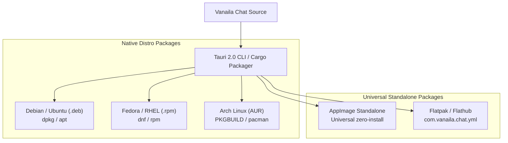

# Multi-Distro Linux Packaging & Distribution

This guide defines how Vanaila Chat (`com.vanaila.chat`) is packaged, built, and distributed across **Debian/Ubuntu, Arch Linux, and Fedora**, as well as universal Linux formats.

---

## 1. Distribution Matrix Overview



---

## 2. Base Build Environment Requirements

To ensure binary compatibility (specifically preventing `GLIBC_X.XX not found` errors on older host systems), all Linux releases must be built in an **Ubuntu 22.04 LTS (Jammy)** container or GitHub Actions runner.

### System Build Dependencies:
```bash
sudo apt-get update && sudo apt-get install -y \
  build-essential \
  curl \
  wget \
  file \
  libssl-dev \
  libgtk-3-dev \
  libwebkit2gtk-4.1-dev \
  libayatana-appindicator3-dev \
  librsvg2-dev \
  patchelf \
  squashfs-tools
```

---

## 3. Package Configurations

### 3.1 Debian & Ubuntu (`.deb`)
Built directly via `pnpm desktop:build` or `cargo tauri build --bundles deb`.

- **Package Name**: `vanaila-chat_0.3.1_amd64.deb`
- **Project Website**: https://github.com/coderaulia/vanailachat
- **Release Details**: See the AppStream metadata in `packaging/com.vanaila.chat.metainfo.xml`.
- **Dependencies**: `libwebkit2gtk-4.1-0`, `libgtk-3-0`, `libayatana-appindicator3-1`, `ca-certificates`
- **Install Command**:
  ```bash
  sudo apt install ./vanaila-chat_0.3.1_amd64.deb
  # Or
  sudo dpkg -i vanaila-chat_0.3.1_amd64.deb && sudo apt-get install -f
  ```

---

### 3.2 Fedora & RHEL (`.rpm`)
Built directly via `pnpm desktop:build` or `cargo tauri build --bundles rpm`.

- **Package Name**: `vanaila-chat-0.3.1-1.x86_64.rpm`
- **Project Website**: https://github.com/coderaulia/vanailachat
- **Release Details**: See the AppStream metadata in `packaging/com.vanaila.chat.metainfo.xml`.
- **Dependencies**: `webkit2gtk4.1`, `gtk3`, `libayatana-appindicator-gtk3`
- **Install Command**:
  ```bash
  sudo dnf install ./vanaila-chat-0.3.1-1.x86_64.rpm
  ```

---

### 3.3 Arch Linux (`PKGBUILD` for AUR)
File location: `packaging/arch/PKGBUILD`

```bash
# Maintainer: Aswanth Manoj <contact@coderaulia.com>
pkgname=vanaila-chat-bin
pkgver=0.3.1
pkgrel=1
pkgdesc="Privacy-first, high-performance local AI chat client with multi-provider LLM support"
arch=('x86_64')
url="https://github.com/coderaulia/vanailachat"
license=('MIT')
depends=('webkit2gtk-4.1' 'gtk3' 'libayatana-appindicator')
optdepends=(
    'ollama: Local offline LLM inference engine'
    'libsecret: Hardware keyring secret storage'
)
provides=('vanaila-chat')
conflicts=('vanaila-chat')
source=("https://github.com/coderaulia/vanailachat/releases/download/v${pkgver}/vanaila-chat_${pkgver}_amd64.deb")
sha256sums=('SKIP')

package() {
    bsdtar -xf data.tar.* -C "$pkgdir/"
}
```

- **Installation**:
  ```bash
  yay -S vanaila-chat-bin
  # Or with paru
  paru -S vanaila-chat-bin
  ```

---

### 3.4 Universal AppImage
Built directly via `pnpm desktop:build` or `cargo tauri build --bundles appimage`.

- **File**: `Vanaila-Chat-0.3.1-x86_64.AppImage`
- **Execution**:
  ```bash
  chmod +x Vanaila-Chat-0.3.1-x86_64.AppImage
  ./Vanaila-Chat-0.3.1-x86_64.AppImage
  ```

---

### 3.5 Flatpak (Flathub Manifest)
File location: `packaging/flatpak/com.vanaila.chat.yml`

```yaml
app-id: com.vanaila.chat
runtime: org.gnome.Platform
runtime-version: '46'
sdk: org.gnome.Sdk
command: vanaila-chat

finish-args:
  - --share=ipc
  - --socket=fallback-x11
  - --socket=wayland
  - --share=network
  - --talk-name=org.kde.StatusNotifierWatcher
  - --talk-name=org.freedesktop.Notifications
  - --talk-name=org.freedesktop.secrets
  - --filesystem=home:ro
  - --filesystem=xdg-documents:rw
  - --filesystem=xdg-download:rw

modules:
  - name: vanaila-chat
    buildsystem: simple
    build-commands:
      - install -Dm755 vanaila-chat /app/bin/vanaila-chat
      - install -Dm644 com.vanaila.chat.desktop /app/share/applications/com.vanaila.chat.desktop
      - install -Dm644 icon-512.png /app/share/icons/hicolor/512x512/apps/com.vanaila.chat.png
    sources:
      - type: archive
        url: https://github.com/coderaulia/vanailachat/releases/download/v0.3.1/vanaila-chat_0.3.1_amd64.deb
```

---

## 4. Automated Multi-Distro CI/CD Workflow

### v0.3.1 release verification

The release pipeline must validate the generated package metadata before publishing artifacts:

```bash
dpkg-deb -f src-tauri/target/release/bundle/deb/*.deb Package Version Architecture
rpm -qp --queryformat '%{NAME} %{VERSION}-%{RELEASE} %{ARCH}\n' src-tauri/target/release/bundle/rpm/*.rpm
sha256sum src-tauri/target/release/bundle/deb/*.deb src-tauri/target/release/bundle/rpm/*.rpm src-tauri/target/release/bundle/appimage/*.AppImage > SHA256SUMS.txt
```

AppImage creation requires the Tauri-downloaded `linuxdeploy` tool and its GTK plugin. If those tools are unavailable or fail on a build host, do not publish a partial “universal” release: retain the verified `.deb`/`.rpm` artifacts and rerun the AppImage job on the Ubuntu 22.04 release runner.

File location: `.github/workflows/build-desktop.yml`

```yaml
name: Build Linux Desktop Packages

on:
  push:
    tags:
      - 'v*'
  workflow_dispatch:

jobs:
  build-linux:
    runs-on: ubuntu-22.04
    steps:
      - name: Checkout Code
        uses: actions/checkout@v4

      - name: Setup PNPM
        uses: pnpm/action-setup@v4
        with:
          version: 9

      - name: Setup Node.js 20
        uses: actions/setup-node@v4
        with:
          node-version: 20
          cache: 'pnpm'

      - name: Setup Rust Stable
        uses: dtolnay/rust-toolchain@stable

      - name: Install Linux Build Dependencies
        run: |
          sudo apt-get update
          sudo apt-get install -y \
            libwebkit2gtk-4.1-dev \
            libgtk-3-dev \
            libayatana-appindicator3-dev \
            librsvg2-dev \
            patchelf \
            squashfs-tools

      - name: Install NPM Dependencies
        run: pnpm install --frozen-lockfile

      - name: Build Frontend & Tauri Bundles
        run: pnpm desktop:build

      - name: Upload Package Artifacts
        uses: actions/upload-artifact@v4
        with:
          name: linux-dist-packages
          path: |
            src-tauri/target/release/bundle/deb/*.deb
            src-tauri/target/release/bundle/rpm/*.rpm
            src-tauri/target/release/bundle/appimage/*.AppImage

      - name: Publish GitHub Release
        if: startsWith(github.ref, 'refs/tags/v')
        uses: softprops/action-gh-release@v2
        with:
          files: |
            src-tauri/target/release/bundle/deb/*.deb
            src-tauri/target/release/bundle/rpm/*.rpm
            src-tauri/target/release/bundle/appimage/*.AppImage
          draft: false
          prerelease: false
```
