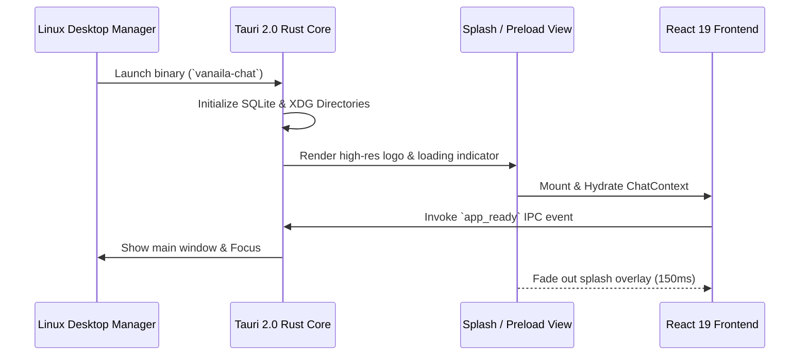

# Desktop UI & Brand Identity Enhancements

This document specifies the user interface, brand identity, visual assets, and desktop-specific layout improvements designed for the native Linux edition of Vanaila Chat.

---

## 1. Native Splash Screen & Loading Transition

To ensure an instant, polished startup experience without white flashes (FOUC) or sluggish initial window rendering, Vanaila Chat implements a **two-stage window presentation workflow**:

### 1.1 Initialization Pipeline
1. **Hidden Initial Window**: The main WebKitGTK window initializes with `visible: false` in `tauri.conf.json`.
2. **Splash Screen HTML/CSS**: A lightweight, zero-dependency inline splash screen renders immediately while React hydrates and the SQLite database checks migrations.
3. **Smooth Reveal Transition**: Once `App.tsx` signals `window_ready`, the Rust layer invokes `window.show()` and triggers a smooth CSS opacity cross-fade.

---

## 2. Brand Identity & Visual Asset Pipeline

### 2.1 Logo & Vector Palette
The Vanaila Chat brand identity is built around a modern, minimalist geometric emblem representing neural connectivity, conversations, and local autonomy.

- **Primary Colors**:
  - `Vanaila Slate Navy`: `#1e1e2e` (Dark Base)
  - `Vanaila Cream Accent`: `#f5e0dc` (Warm Brand Tone)
  - `Teal Gradient Highlight`: `#94e2d5` → `#89b4fa` (Ollama & AI Streaming Pulse)
- **Asset Formats**:
  - `icon.svg`: Master scalable vector icon installed to `/usr/share/icons/hicolor/scalable/apps/com.vanaila.chat.svg`.
  - High-DPI PNG exports (`16px`, `24px`, `32px`, `48px`, `64px`, `128px`, `256px`, `512px`).

---

## 3. Desktop Responsiveness & Layout Adaptations

While the web version is constrained by browser window margins, the desktop app introduces optimizations for large displays, multi-monitor setups, and tiling window managers (i3, Sway, Hyprland):

### 3.1 Adaptive Multi-Column Layout (`App.css` Enhancements)
- **Ultra-Wide (> 1440px)**:
  - Expands the main chat column max-width from `768px` to `1024px` for reading code blocks and comparison tables without horizontal scrolling.
  - Side-by-side **Codebase Workspace Panel** and **Live Markdown Preview**.
- **Standard Desktop (1024px – 1440px)**:
  - Persistent sidebar with quick-access project trees and pinned chats.
- **Tiling / Compact (< 860px)**:
  - Collapsible sidebar with auto-drawer overlay.
  - Compact header pills and optimized composer action toolbar.

### 3.2 macOS-Style Traffic Lights & Frosted Glass Title Bar
For a native desktop aesthetic matching modern macOS and Libadwaita applications:
- **Integrated Traffic Lights**: Rendered on the far left in desktop mode with red (close), yellow (minimize), and green (maximize/zoom) buttons with subtle glyph hover states (`✕`, `−`, `+`).
- **Frosted Glass Styling**: Uses `backdrop-filter: blur(24px) saturate(180%)` with a slim `44px` height profile and subtle `1px solid rgba(255, 255, 255, 0.08)` highlight border.
- **Window Drag Regions**: The top navigation bar includes `data-tauri-drag-region`, allowing users to seamlessly drag the window from any empty header area.
- **Interactive Boundaries**: Buttons and pills have explicit `-webkit-app-region: no-drag` so all click and hover micro-interactions remain responsive.
- **Pulsing Engine Status**: Real-time connected/idle indicator dot and thinking pulse badge.

---

## 4. Desktop-Grade Interactions

### 4.1 Native File Drag-and-Drop
Users can drag files directly from their Linux file manager (Nautilus, Dolphin, Thunar) into the chat window:
- Dropping `.pdf`, `.docx`, `.xlsx`, or `.txt` into the composer triggers automatic text extraction and context attachment.
- Dropping a folder automatically opens the workspace directory selector.

### 4.2 Linux Keyboard Accelerators

| Shortcut | Action | Scope |
| :--- | :--- | :--- |
| `Ctrl + N` | Create New Chat Session | Global in-app |
| `Ctrl + Shift + N` | Create New Workspace Project | Global in-app |
| `Ctrl + /` | Toggle Sidebar Visibility | Global in-app |
| `Ctrl + ,` | Open Settings Modal | Global in-app |
| `Ctrl + K` | Focus Global Message / Chat Search | Global in-app |
| `Alt + S` | Toggle Web Search Agent Tool | Composer |
| `Escape` | Abort Active Stream / Close Modal | Active context |

---

## 5. Offline Font Bundling & Typography

To guarantee 100% offline functionality without Google Fonts CDN latency:
- **UI Sans-Serif Font**: `Inter-Variable.woff2` (Weights 100–900)
- **Editorial / Serif Font**: `Lora-Variable.woff2` (Weights 400–700)
- Bundled into `public/fonts/` and loaded directly through `@font-face` definitions in `src/frontend/styles/tokens.css`.
